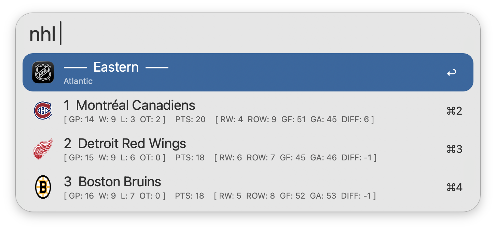

#  NHL Stats

View the latest NHL standings &amp; stats in Alfred

## Setup

This workflow requires [jq](https://jqlang.github.io/jq/) to function, which comes preinstalled on macOS 15 Sequoia and later.

## Usage

View the latest [NHL](https://www.nhl.com/) standings via the `nhl` keyword. Type to filter by Team, Ranking, Division, Conference, or Wildcard.

* <kbd>↩</kbd> View Team Stats.
* <kbd>⌘</kbd><kbd>↩</kbd> Rank teams by Division.
* <kbd>⌥</kbd><kbd>↩</kbd> Rank teams by Conference.
* <kbd>⌃</kbd><kbd>↩</kbd> Rank teams by League.

Additional Team Stats can be viewed directly within Alfred. This includes League, Home, Away, and L10 Stats.

* <kbd>⌥</kbd><kbd>↩</kbd> Refresh Team Stats.

Append `::` to the configured [Keyword](https://www.alfredapp.com/help/workflows/inputs/keyword) to access other actions, such as manually reloading the standings cache.

Configure the [Hotkey](https://www.alfredapp.com/help/workflows/triggers/hotkey/) as a shortcut for viewing standings.